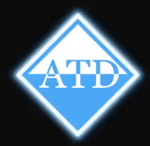
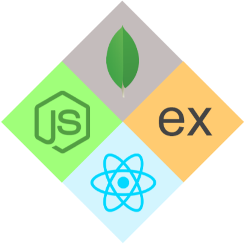

<a href="https://andrewdiles.com">
	<picture>
  	<source srcset="./assets/logo.gif" media="(prefers-color-scheme: dark)">
  	<source srcset="./assets/light-logo.gif" media="(prefers-color-scheme: light)">
  	
	</picture>
</a>

# 💫 About Me:

 

I've had the joy of teaching the MERN stack for three years 😊  
I love solving problems and helping others learn 🧑‍🏫  
I'm passionate about implementing game design principles to maximize learning 🧠  

# 💻 Tech Stack:

                               

# 📊 GitHub Stats:

 

## ✍️ Random Dev Quote

## 🌐 Socials:

  

[andrewdiles.com](https://andrewdiles.com)

<!-- Proudly created with GPRM ( https://gprm.itsvg.in ) -->
